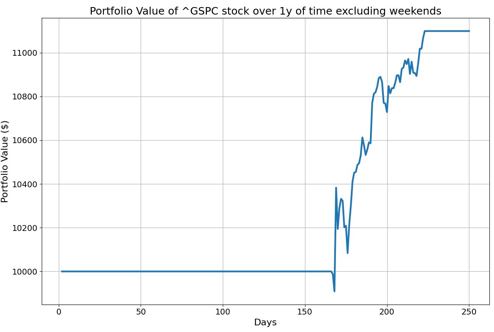

# Simple Trading Bot

This is a basic algorithmic trading bot written in Python.  
It simulates a buy-low-sell-high strategy based on historical data using [Yahoo Finance](https://finance.yahoo.com/).
It saves the state of the portfolio to a text file and visualizes the data.

# Features of the trading bot
- Historical data loading via yfinance
- Strategy: buy if the price hits a new local minimum, sell if it hits a new local maximum
- Flexible user input (cash, period, ticker) via CLI using argparse
- Portfolio logging to portfolio_journal.txt
- Visualization of portfolio value over the trading period using matplotlib

# Example use
py bot.py --cash 100000 --period 6mo --ticker AAPL
py bot.py --cash 5000
py bot.py --cash 100000 --period 6mo --ticker TSLA
py bot.py --cash 1000000 --ticker NVDA
py bot.py

# Requirements
pip install yfinance pandas matplotlib